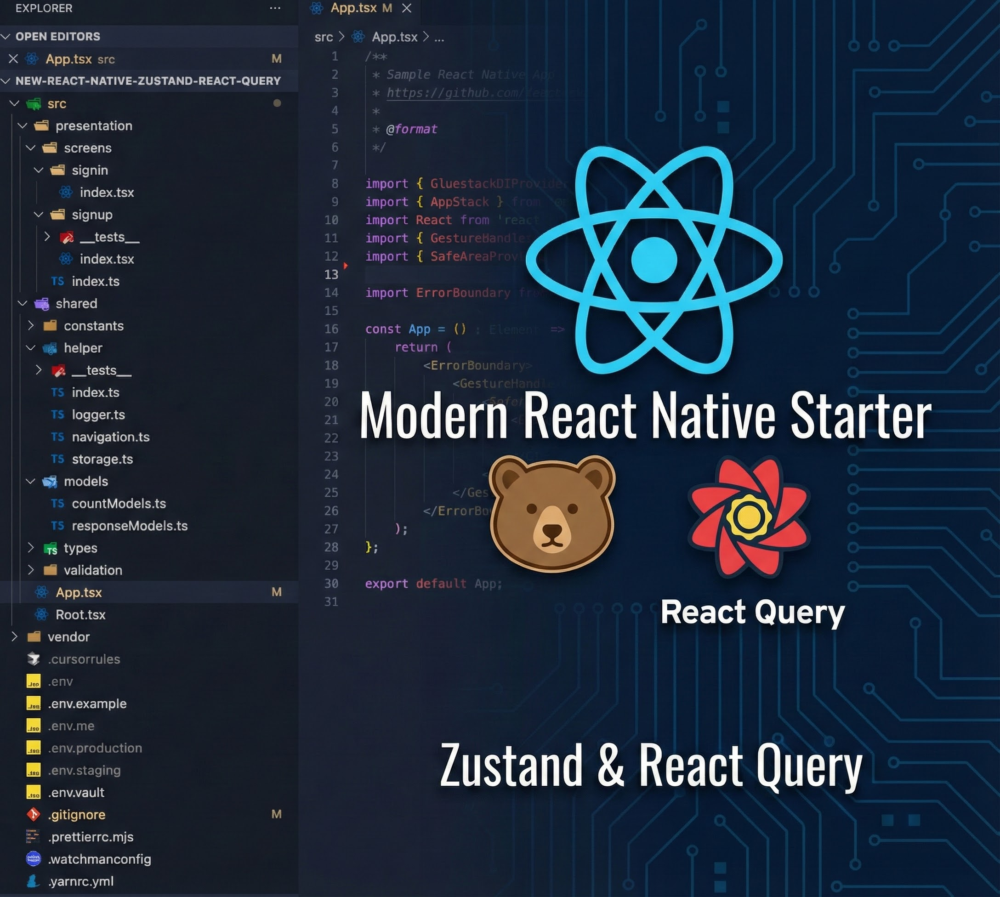

<div>
  <h1>🚀 React Native Modern Architecture</h1>
  <p align="center">
    
  </p>
  <p>A modern React Native boilerplate with Zustand, React Query and best practices</p>
  <p><strong>Create a new project using our CLI: <a href="https://github.com/linhnguyen-gt/create-rn-project">create-rn-project</a></strong></p>

  <p>
    <a href="https://reactnative.dev/" target="_blank">
      
    </a>
    <a href="https://www.typescriptlang.org/" target="_blank">
      
    </a>
  </p>

### Core Libraries

  <p>
    
    
    
  </p>

### State Management & API

  <p>
    
    
    
  </p>

### UI & Styling

  <p>
    
    
    
  </p>

### Form & Validation

  <p>
    
    
  </p>

### Development & Testing

  <p>
    
    
    
  </p>

### Environment & Storage

  <p>
    
    
    
  </p>

### Development Tools

  <p>
    
    
  </p>

### Environment Support

  <p>
    
    
  </p>
</div>

## Key Features

### Architecture & State Management

- **Well-organized Architecture** with clear separation of concerns:
    - Presentation Layer (UI/Screens/Hooks)
    - Application Layer (State Management)
    - Data Layer (API/Storage)
    - Shared (Models/Utilities)
- **Modern State Management**
    - Zustand for client-side state
    - React Query for server-side state
    - Async Storage for persistence

### Development Experience

- TypeScript for type safety
- Cross-platform (iOS & Android)
- NativeWind & Tailwind CSS for styling
- Jest setup for testing
- ESLint & Prettier configuration

### UI & Components

- Gluestack UI components
- Responsive design patterns
- Custom hooks and components
- Form handling with react-hook-form & zod

### Environment & Configuration

- Multi-environment support (Dev/Staging/Prod)
- Environment variable management
- Flavor/Scheme based builds
- Version management system

## Architecture Overview

The project follows a simplified but well-organized architecture to maintain:

- Separation of concerns
- Modularity
- Testability
- Maintainability

### Layer Responsibilities

1. **Presentation Layer** (`src/presentation/`)
    - UI Components
    - Screens
    - Navigation
    - Hooks for data access

2. **Application Layer** (`src/app/`)
    - State Management (Zustand stores)
    - Application-wide providers

3. **Data Layer** (`src/data/`)
    - API services
    - HTTP client
    - Storage services
    - External service integrations

4. **Shared Layer** (`src/shared/`)
    - Models
    - Types
    - Constants
    - Utility functions

## Quick Start

### Prerequisites

Make sure you have the following installed:

- Node.js (v20+)
- Yarn
- React Native CLI
- Xcode (for iOS)
- Android Studio (for Android)
- Ruby (>= 2.6.10)
- CocoaPods

### Installation

### Clone the repository\*\*

```bash
git clone https://github.com/linhnguyen-gt/new-react-native-zustand-react-query
cd new-react-native-zustand-react-query
```

## Environment Configuration

### Setup Environment

First, you need to run the environment setup script:

```bash
# Using npm
npm run env:setup

# Using yarn
yarn env:setup
```

This script will:

1. Set up dotenv-vault (optional)
2. Create environment files for all environments:
    - `.env` (Development environment)
    - `.env.staging` (Staging environment)
    - `.env.production` (Production environment)
3. Configure necessary environment variables

> ℹ️ **Expo Go note**: When launching the project with `npx expo start`, the native `react-native-config` module is unavailable. The shared `appConfig` helper will fall back to the `.env` defaults and log a warning in development. Use the `yarn android` / `yarn ios` dev builds whenever you need the real native values.

### Environment Files Structure

Each environment file contains:

```bash
# Required Variables
APP_FLAVOR=development|staging|production
VERSION_CODE=1
VERSION_NAME=1.0.0
API_URL=https://api.example.com

# Optional Variables (configured during setup)
GOOGLE_API_KEY=
FACEBOOK_APP_ID=
# ... other variables
```

### Using Different Environments

```bash
# Development (default)
yarn android
yarn ios

# Staging
yarn android:stg
yarn ios:stg

# Production
yarn android:pro
yarn ios:pro
```

### Setup Steps environment for New Project

This project uses [react-native-config](https://github.com/lugg/react-native-config) for environment variable management. Follow these detailed steps to set up environment configuration for a new project.

#### 1. Install react-native-config

The package is already included in this project, but for new projects:

```bash
yarn add react-native-config
# or
npm install react-native-config
```

#### 2. Android Configuration

##### 2.1 Update android/app/build.gradle

Add the environment configuration mapping and apply the dotenv plugin:

```gradle
// Add this before the android block
project.ext.envConfigFiles = [
    dev              : ".env",
    staging          : ".env.staging",
    production       : ".env.production",
]

// Apply the dotenv plugin
apply from: project(":react-native-config").projectDir.getPath() + "/dotenv.gradle"

android {
    // ... existing configuration

    defaultConfig {
        // Use environment variables for version
        versionCode project.env.get("VERSION_CODE").toInteger()
        versionName project.env.get("VERSION_NAME")

        // Add build config fields for environment variables
        buildConfigField "String", "API_URL", "\"${project.env.get("API_URL")}\""
        buildConfigField "String", "APP_FLAVOR", "\"${project.env.get("APP_FLAVOR")}\""
    }

    // Configure product flavors
    flavorDimensions 'default'
    productFlavors {
        dev {
            dimension 'default'
            applicationId 'com.yourcompany.yourapp'
            resValue 'string', 'build_config_package', 'com.yourcompany.yourapp'
        }
        staging {
            dimension 'default'
            applicationId 'com.yourcompany.yourapp.stg'
            resValue 'string', 'build_config_package', 'com.yourcompany.yourapp'
        }
        production {
            dimension 'default'
            applicationId 'com.yourcompany.yourapp.prod'
            resValue 'string', 'build_config_package', 'com.yourcompany.yourapp'
        }
    }
}

dependencies {
    // Add react-native-config dependency
    implementation project(':react-native-config')
    // ... other dependencies
}
```

##### 2.2 Update MainApplication.kt/java

Add the RNCConfigPackage to your packages list:

```kotlin
// MainApplication.kt
import com.lugg.RNCConfig.RNCConfigPackage

class MainApplication : Application(), ReactApplication {
    override fun getPackages(): List<ReactPackage> =
        PackageList(this).packages.apply {
            add(RNCConfigPackage())
        }
}
```

##### 2.3 Proguard Configuration (Release Builds)

Add to `android/app/proguard-rules.pro`:

```proguard
# Keep BuildConfig class for react-native-config
-keep class com.yourcompany.yourapp.BuildConfig { *; }
```

#### 3. iOS Configuration

##### 3.1 Create Config.xcconfig

Create `ios/Config.xcconfig`:

```xcconfig
#include? "tmp.xcconfig"
```

##### 3.2 Update Podfile

Add environment file configuration to your Podfile:

```ruby
# Add this to your Podfile
# configuration name environment
project 'NewReactNativeZustandRNQ',{
        'Debug' => :debug,
        'Release' => :release,
        'Staging.Debug' => :debug,
        'Staging.Release' => :release,
        'Product.Debug' => :debug,
        'Product.Release' => :release,
}
```

##### 3.3 Configure Build Schemes

1. **Create Build Schemes** for different environments:
    - Development (uses `.env`)
    - Staging (uses `.env.staging`)
    - Production (uses `.env.production`)

2. **Add Pre-actions** to each scheme:
    - Go to Product → Scheme → Edit Scheme
    - Select Build → Pre-actions
    - Add "New Run Script Action" with:

    ```bash
    # For development (default)
    ROOT_DIR=${WORKSPACE_PATH%/*}/..
    IOS_DIR=${WORKSPACE_PATH%/*}
    if [ -z "$WORKSPACE_PATH" ] && [ -n "$PROJECT_DIR" ]; then
      ROOT_DIR="${PROJECT_DIR}/.."
      IOS_DIR="${PROJECT_DIR}"
    fi

    "${ROOT_DIR}/node_modules/react-native-config/ios/ReactNativeConfig/BuildXCConfig.rb" "${ROOT_DIR}" "${IOS_DIR}/tmp.xcconfig"

    # For staging scheme
    ROOT_DIR=${WORKSPACE_PATH%/*}/..
    IOS_DIR=${WORKSPACE_PATH%/*}
    if [ -z "$WORKSPACE_PATH" ] && [ -n "$PROJECT_DIR" ]; then
      ROOT_DIR="${PROJECT_DIR}/.."
      IOS_DIR="${PROJECT_DIR}"
    fi

    export ENVFILE=.env.staging
    "${ROOT_DIR}/node_modules/react-native-config/ios/ReactNativeConfig/BuildXCConfig.rb" "${ROOT_DIR}" "${IOS_DIR}/tmp.xcconfig"

    # For production scheme
    ROOT_DIR=${WORKSPACE_PATH%/*}/..
    IOS_DIR=${WORKSPACE_PATH%/*}
    if [ -z "$WORKSPACE_PATH" ] && [ -n "$PROJECT_DIR" ]; then
      ROOT_DIR="${PROJECT_DIR}/.."
      IOS_DIR="${PROJECT_DIR}"
    fi

    export ENVFILE=.env.production
    "${ROOT_DIR}/node_modules/react-native-config/ios/ReactNativeConfig/BuildXCConfig.rb" "${ROOT_DIR}" "${IOS_DIR}/tmp.xcconfig"
    ```

##### 3.4 Update Info.plist (Optional)

You can access environment variables in Info.plist:

```xml
<key>API_URL</key>
<string>$(API_URL)</string>
<key>APP_FLAVOR</key>
<string>$(APP_FLAVOR)</string>
```

#### 4. Environment Files Structure

Create environment files in your project root:

##### .env (Development)

```bash
# Development Environment
APP_FLAVOR=development
VERSION_CODE=1
VERSION_NAME=1.0.0
API_URL=http://localhost:3000
APP_NAME=MyApp Dev
```

##### .env.staging

```bash
# Staging Environment
APP_FLAVOR=staging
VERSION_CODE=1
VERSION_NAME=1.0.0
API_URL=https://api-staging.example.com
APP_NAME=MyApp Staging
```

##### .env.production

```bash
# Production Environment
APP_FLAVOR=production
VERSION_CODE=1
VERSION_NAME=1.0.0
API_URL=https://api.example.com
APP_NAME=MyApp
```

#### 5. Update package.json Scripts

```json
{
    "scripts": {
        "android": "yarn check:env && npx expo run:android --device --variant devDebug",
        "android:stg": "yarn check:env && npx expo run:android --device --variant stagingDebug --app-id com.yourcompany.yourapp.stg",
        "android:prod": "yarn check:env && npx expo run:android --device --variant productionDebug --app-id com.yourcompany.yourapp.prod",
        "ios": "yarn check:env && npx expo run:ios --device",
        "ios:stg": "yarn check:env && ENVFILE=.env.staging npx expo run:ios --device --scheme Staging --configuration Staging.Debug",
        "ios:prod": "yarn check:env && ENVFILE=.env.production npx expo run:ios --device --scheme Product --configuration Product.Debug"
    }
}
```

#### 6. Update .gitignore

```bash
# Environment files
.env
.env.*
!.env.example
!.env.vault

# iOS generated config
ios/tmp.xcconfig
```

#### 7. Using Environment Variables in Code

##### TypeScript Types

Create `src/shared/types/react-native-config.d.ts`:

```typescript
declare module 'react-native-config' {
    export interface NativeConfig {
        APP_FLAVOR: 'development' | 'staging' | 'production';
        VERSION_CODE: string;
        VERSION_NAME: string;
        API_URL: string;
        APP_NAME: string;
        [key: string]: string;
    }

    const Config: NativeConfig;
    export default Config;
}
```

#### 8. Version Management

The setup automatically manages app versions based on environment files:

- **VERSION_CODE**: Used for internal build numbering (Android)
- **VERSION_NAME**: Used for display version in stores
- **APP_FLAVOR**: Used to identify the current environment

#### 9. Important Notes

- **Never commit `.env` files** to git (they are automatically added to .gitignore)
- **Always commit `.env.example`** and `.env.vault` (if using dotenv-vault)
- **Share vault credentials** with your team members if using dotenv-vault
- **Test all environments** before deploying to production
- **Use different app IDs** for different environments to allow side-by-side installation

## Project Structure

```
src/
├── app/                   # Application Layer
│   ├── providers/        # App-wide providers
│   └── store/           # Zustand stores
│
├── data/                 # Data Layer
│   ├── api/             # Raw API functions
│   ├── queries/         # React Query hooks
│   │   ├── queryKeys.ts # Centralized query keys
│   │   └── ...          # Domain-specific query hooks
│   └── services/        # Infrastructure services
│       ├── httpClient/  # HTTP client configuration
│       └── ...          # Other services
│
├── presentation/         # UI Layer
│   ├── components/      # Reusable UI components
│   ├── hooks/          # UI-related custom hooks
│   ├── screens/        # Screen components
│   └── navigation/     # Navigation setup
│
└── shared/              # Shared utilities
    ├── constants/      # Application constants
    ├── models/         # Data models
    ├── types/          # Type definitions
    └── utils/          # Utility functions
```

## Development Tools

### Reactotron

For debugging, the project includes Reactotron integration. To use it:

1. Install Reactotron on your development machine
2. Run the following command for Android:

```bash
yarn adb:reactotron
```

## Code Style

The project uses ESLint and Prettier for code formatting. Run linting with:

```bash
yarn lint # Check for issues
```

To fix linting errors automatically, use:

```bash
yarn lint:fix # Fix automatic issues
```
